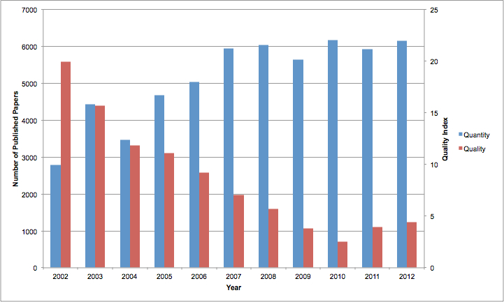

[Communications Research](https://github.com/thampiman/Data-Science/tree/master/Communications-Research)
=====
A Python project that analyses trends in wireless communications research from 2002-2012. 

## The Data
The data collection process is shown below.

Meta-data from the following conferences and journals are obtained from the [IEEE](http://ieeexplore.ieee.org/gateway/) database.

1. Conferences
   1. European Wireless (EW)
   2. Global Communications Conference (Globecom)
   3. International Conference on Communications (ICC)
   4. International Symposium on Wireless Communication Systems (ISWCS)
   5. Personal, Indoor, and Mobile Radio Communications (PIMRC)
   6. Vehicular Technology Conference - Spring (VTC-Spring)
   7. Vehicular Technology Conference - Fall (VTC-Fall)
   8. Wireless Communications and Networking Conference (WCNC)
   9. World of Wireless, Mobile and Multimedia Networks (WoWMoM)
2. Journals
   1. Journal on Selected Areas in Communications (JSAC)
   2. Communications Letters (Letters)
   3. Transactions on Vehicular Technology (TVT)
   4. Transactions on Wireless Communications (TWC)

The citations are then obtained from [Microsoft Academic Search](http://academic.research.microsoft.com/). In order to use the [API](http://academic.research.microsoft.com/about/Microsoft%20Academic%20Search%20API%20User%20Manual.pdf), add your own ID in the [settings.json](https://github.com/thampiman/Data-Science/blob/master/Communications-Research/settings.json) file. The citations are then cleaned up and validated using [Google Scholar](http://scholar.google.com). 

The locations of the primary authors of the papers are obtained from the [MaxMind](https://www.maxmind.com/en/worldcities) world cities database. Any missing data is then obtained from [Google](http://google.com).

## Metrics and Preliminary Analysis
The [code](https://github.com/thampiman/Data-Science/blob/master/Communications-Research/analyse_data.py) to analyse the data uses the following metrics:

1. Number of publications
2. Number of citations
3. Quality index = Number of citations / Number of publications

The following graph shows the quantity and quality of papers over the years.

## Top Trends
Keywords from all the papers are analysed and the highly cited topics from over the years are shown in the bubble chart below.

## Top Countries
The contributions of countries from across the globe can be seen in the map below.

The top 20 countries in terms of number of publications are:

1. USA (13115)
2. China (5900)
3. Canada (3748)
4. South Korea (3671)
5. UK (3206)
6. Germany (2940)
7. Italy (2450)
8. Japan (2356)
9. France (1941)
10. Taiwan (1780)
11. Singapore (1335)
12. Spain (1192)
13. Australia (952)
14. Finland (951)
15. Sweden (835)
16. Greece (666)
17. India (612)
18. Hong Kong (576)
19. Iran (420)
20. Brazil (395)

The top 20 countries in terms of quality are:

## Contributions and Rankings of Conferences and Journals

License
=====
The MIT License (MIT)