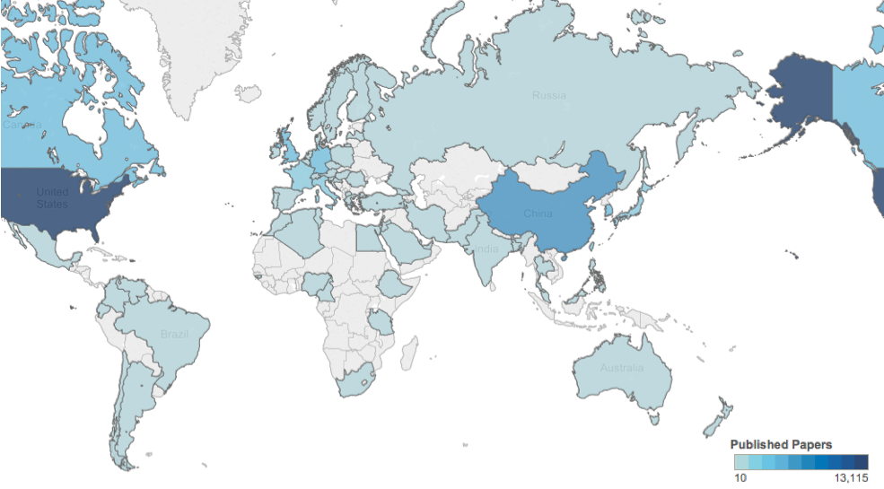
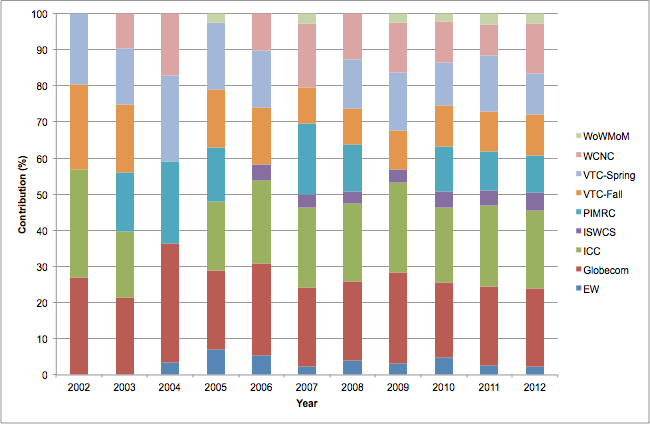

Communications Research
=====
This Python project under [Communications-Research](https://github.com/thampiman/Data-Science/tree/master/Communications-Research) analyses trends in wireless communications research from 2002-2012. Meta-data of major conferences and journals are obtained programmatically from the [IEEE](http://ieeexplore.ieee.org/gateway/) database. The citations are then obtained from [Microsoft Academic Search](http://academic.research.microsoft.com/) (programmatically) and [Google Scholar](http://scholar.google.com) (manually). The location of the primary authors of the papers are also obtained from the [MaxMind](https://www.maxmind.com/en/worldcities) world cities database (programmatically) and [Google](http://google.com) (manually). All this information is analysed to obtain trends in the past decade. 

## The Data
The data collection process is shown below.

### Acquisition
Papers published from 2002-2012 from the following conferences and journals are obtained:

1. Conferences
   1. European Wireless (EW)
   2. Global Communications Conference (Globecom)
   3. International Conference on Communications (ICC)
   4. International Symposium on Wireless Communication Systems (ISWCS)
   5. Personal, Indoor, and Mobile Radio Communications (PIMRC)
   6. Vehicular Technology Conference - Spring (VTC-Spring)
   7. Vehicular Technology Conference - Fall (VTC-Fall)
   8. Wireless Communications and Networking Conference (WCNC)
   9. World of Wireless, Mobile and Multimedia Networks (WoWMoM)
2. Journals
   1. Journal on Selected Areas in Communications (JSAC)
   2. Communications Letters (Letters)
   3. Transactions on Vehicular Technology (TVT)
   4. Transactions on Wireless Communications (TWC)

The source code can be found [here](https://github.com/thampiman/Data-Science/blob/master/Communications-Research/acquire_data.py) and the raw data in XML format can be found [here](https://github.com/thampiman/Data-Science/tree/master/Communications-Research/raw-data).

### Processing
The raw XML data is processed and converted to JSON. In addition, the citations for each paper is obtained using the [API](http://academic.research.microsoft.com/about/Microsoft%20Academic%20Search%20API%20User%20Manual.pdf) provided by Microsoft. In order to run the [code](https://github.com/thampiman/Data-Science/blob/master/Communications-Research/process_data.py), add your own API ID in the [settings.json](https://github.com/thampiman/Data-Science/blob/master/Communications-Research/settings.json) file. In order to obtain the location of each paper, a dictionary is first created using the [data](https://github.com/thampiman/Data-Science/blob/master/Communications-Research/location-data/worldcitiespop.txt.zip) obtained from MaxMind where the key is the city/town and the value is the country. The affiliations data from the raw IEEE data is then stripped and the dictionary is searched to obtain the country. If a unique country is obtained, then it is saved in the processed JSON data. All the processed data can be found [here](https://github.com/thampiman/Data-Science/tree/master/Communications-Research/processed-data).

## Metrics and Preliminary Analysis

## Top Trends

## Top Countries

## Contributions and Rankings of Conferences and Journals

License
=====
The MIT License (MIT)